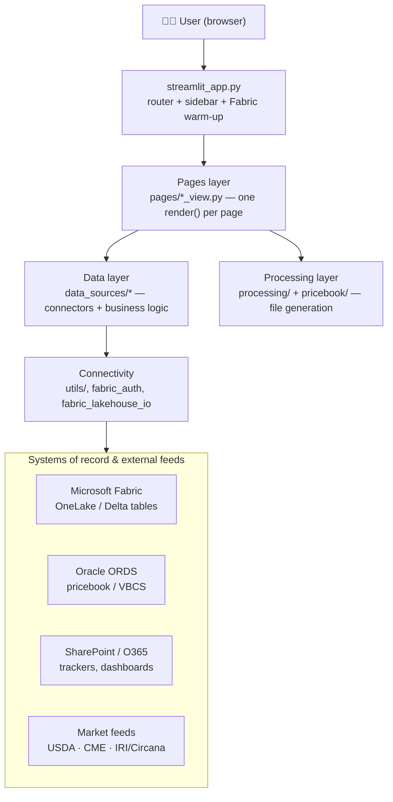
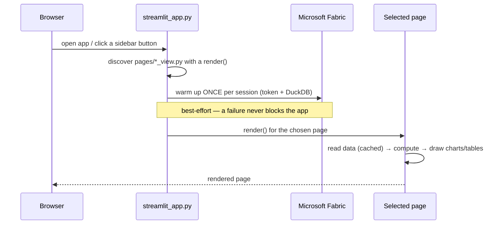
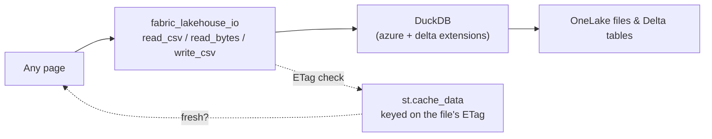
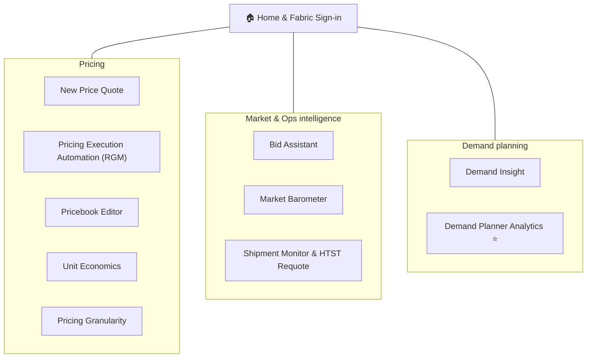
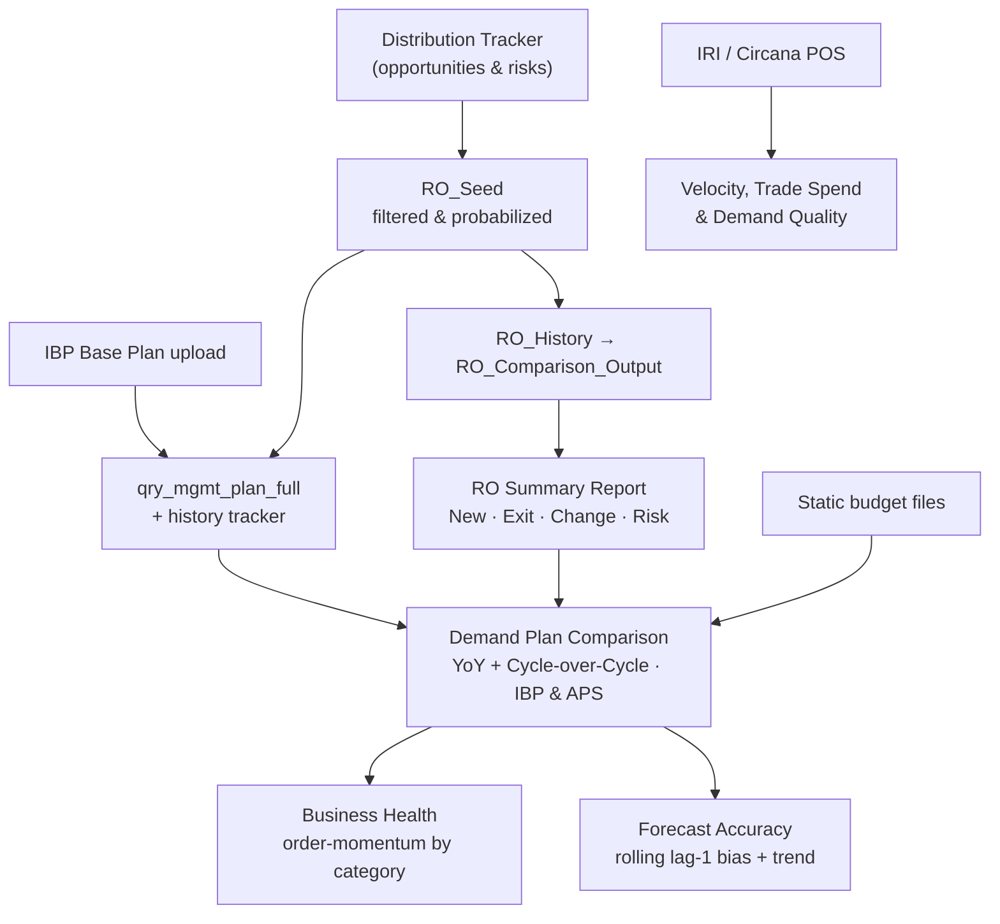

# Darigold Pricing Intelligence — System Design

A single **Streamlit** web app that gives the Darigold pricing & demand‑planning
teams one place to see their data, run their recurring workflows, and push
results back to the systems of record. This document explains **how the system
is put together** — the moving parts, how they fit, and how data flows through
them. It is a design overview, not a user manual.

---

## 1. The big picture

The app is built in clear layers. Each layer only talks to the one below it, so
any single page, connector, or data source can change without disturbing the
rest.



**One-line summary of each layer**

| Layer | Folder | Responsibility |
|---|---|---|
| Router | `streamlit_app.py` | Discovers pages, draws the sidebar, routes clicks, warms up Fabric once per session |
| Pages | `pages/` | All screen layout & interaction — each file exposes a `render()` |
| Data | `data_sources/` | Reads/writes each source and does the domain math (no UI code) |
| Processing | `processing/`, `pricebook/` | Turns inputs into the exact output files Oracle/VBCS expect |
| Connectivity | `utils/`, `data_sources/fabric_*` | Auth, the OneLake/DuckDB reader, shared CSS & widgets |

---

## 2. How a page loads

The router keeps the entry point tiny: it finds the pages, signs in to Fabric
**once**, and then just calls the selected page's `render()`.



Two design choices make this reliable:

- **Warm up Fabric up front, once.** Sign‑in and the DuckDB setup cost is paid a
  single time per session, so every later data read on any page is fast. If it
  fails, the app still runs — pages that need Fabric prompt for sign‑in when you
  open them.
- **Pages are self‑contained.** Adding a page is just dropping a
  `*_view.py` with a `render()` into `pages/` and naming it in the router's map.

---

## 3. Data & connectivity

Most data lives in **Microsoft Fabric OneLake**. The app reads it through one
small connector so every page reads the same way, with the same caching and
freshness rules.



**Freshness by ETag.** Cached reads are keyed on each file's ETag (its version
stamp). When a file is re‑published in Fabric, its ETag changes, the cache key
changes, and the next render re‑reads automatically — no manual "clear cache".
Slow‑moving files also carry a time‑to‑live as a backstop.

**Graceful degradation.** Every connector returns empty/zero and a soft note
when a source is missing, instead of throwing — so one unavailable feed never
takes down a whole page.

**Secrets** live only in a git‑ignored local secrets file (Fabric, Oracle, and
O365 credentials). They are never committed and never printed.

---

## 4. The pages at a glance



| Page | What it is for |
|---|---|
| **Home & Fabric Sign‑in** | Landing + one‑click Microsoft Fabric connection |
| **New Price Quote** | Build a customer price quote from cost + policy inputs |
| **Pricing Execution Automation** | Generate the VBCS files Oracle needs (Fixed / KS / Variable / Combine) |
| **Pricebook Editor** | Review and push pricebook changes to Oracle ORDS |
| **Unit Economics / Pricing Granularity** | Cost & margin breakdowns |
| **Bid Assistant** | Support RFP/bid decisions |
| **Market Barometer** | USDA / CME market context |
| **Shipment Monitor & HTST Requote** | Track shipments and trigger requotes |
| **Demand Insight** | Consumer & shipment demand views |
| **Demand Planner Analytics ⭐** | The demand‑planning command center (section 5) |

---

## 5. Deep dive — Demand Planner Analytics

This is the richest subsystem. It turns raw opportunity and plan inputs into a
reconciled view of **what's planned, what changed, and where the risk is**.



**The main ideas**

- **One probabilized pipeline feeds everything.** Opportunities and risks flow
  from the Distribution Tracker into `RO_Seed`, then into both the demand plan
  (`qry_mgmt_plan_full` + history tracker) and the RO reporting chain
  (`RO_Comparison_Output` → RO Summary Report). Downstream views never
  re‑derive this — they read the shared outputs by label path.
- **Risk is first‑class.** A negative anticipated volume is a demand risk; it is
  captured through the pipeline and broken out as its own **Risk** column in the
  RO Summary (alongside New / Exit / Change), so `New + Exit + Change + Risk`
  reconciles to the total change.
- **Everything reconciles to one source.** The comparison's R&O Volume and R&O
  Variance read the live RO Summary rollup, so the numbers on the comparison
  tables match the RO Summary Report headline‑for‑headline.
- **Read‑the‑story layout.** Each panel leads with the "so‑what" (a trend or a
  headline metric), then the supporting table, then the detail drill‑ins.

---

## 6. Design principles

- **Strict layering.** UI never reads a source directly; it calls a
  `data_sources/*` function. Domain math lives in the data layer and is unit‑
  tested without Streamlit.
- **Read the same way everywhere.** One OneLake connector + ETag caching, reused
  by every page.
- **Never break the page.** Missing source → empty + a soft note, not a crash.
- **Reproducible outputs.** File generators (VBCS, pricebook) are pure
  functions of their inputs, so a given input always yields the same output.
- **No secrets in the repo.** Credentials stay in the local secrets file only.

---

## 7. Repository map

```
Pricing_Execution_Assistant/
├── streamlit_app.py     # router, sidebar, Fabric warm-up
├── pages/               # one *_view.py per screen (render())
├── data_sources/        # connectors + domain logic (Fabric, ORDS, O365, market feeds)
├── processing/          # VBCS / pricing file generators
├── pricebook/           # Oracle ORDS pricebook client + editor
├── utils/               # shared UI (CSS, footer), Fabric sign-in widget
└── tests/               # pytest suite for the data layer (no Streamlit needed)
```

---

## 8. Running it

```bash
pip install -r requirements.txt
python -m streamlit run streamlit_app.py
```

Fabric‑backed pages need a Microsoft Fabric sign‑in (prompted on first use);
local‑only pages work without it.
